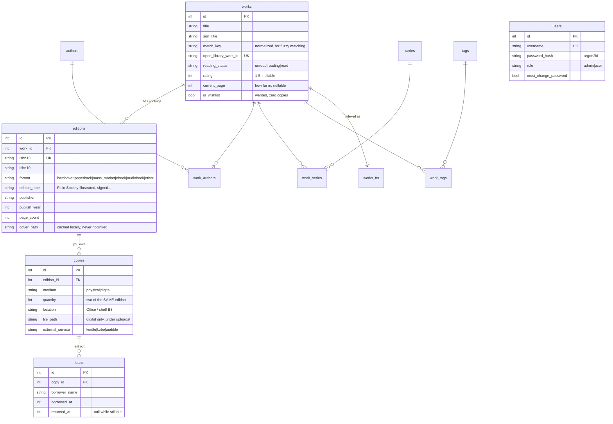

# 03 — Data model

## The three levels

```
Work        the book as an idea       "Dune", by Frank Herbert
 └─ Edition  a specific publication    Ace, 2005, paperback, ISBN 9780441013593, 544pp
     └─ Copy   a thing you own          on shelf B3, ×2   |   an EPUB on disk
```

This split is not bookkeeping pedantry — it is what makes the bookshop verdict useful.
Collapse it and you get one of two broken answers:

- **Work only:** "you own Dune." Useless — you are holding a hardcover and you own the
  paperback, and the app cannot tell you that.
- **Edition only:** "you don't own this." Technically true and actively misleading; you
  own the same book in a different printing and probably don't want a second.

Keeping all three levels is what lets `OWNED_SAME_EDITION` and `OWNED_OTHER_EDITION` be
different answers.



## Where each thing lives, and why

**Reading status, rating and notes are on the `work`.** You read *Dune*; you do not read
the 2005 Ace printing. Recording it per edition would mean re-entering it every time you
bought another copy.

**`current_page` is nullable, and null is not zero.** Null means you are not tracking how
far in you are; zero would mean you are on page zero. Only the first is common, and the
reading room shows a progress bar for a book only when it has both a page and an edition
that records a page count. Finishing or re-shelving a book clears it.

**`quantity` is on the `copy`.** This is the "I own two of the same edition" case the
brief called out: two identical paperbacks are one copy row with `quantity = 2`, not two
rows. Two *different* printings are two editions.

**Rooms are read out of `location`, not stored.** `location` is free text — "Office / B4".
The sidebar's room list and the shelves view derive a room and a shelf from it by
splitting on the first `/`, `,` or `·`, case- and whitespace-insensitively, so
"Stairs / C2" and "Stairs/C2" are one shelf. This is a convention, not a constraint:
nothing stops two spellings of a room from drifting apart, and only the owner can decide
that "Staits" was meant to be "Stairs". A real `rooms` table would fix that, at the cost
of making everyone fill one in. See `src/lib/shelves.ts`.

**`location` is on the copy, not the edition.** Your hardcover is in the office and your
paperback is by the bed.

**`is_wishlist` is on the work, and is derived in practice.** A wishlist entry is a work
flagged `is_wishlist` with zero copies. Adding a copy clears the flag automatically
(`clearWishlistFlagForEdition` in `src/db/mutations/catalog.ts`) — you cannot own a book
and want it at the same time.

**Loans hang off the copy, and their status is derived too.** You lend the physical thing
you have, not the idea of the book — so `loans.copy_id`, which is also what makes lending
possible only for something you own. A loan is open exactly while `returned_at` is null;
there is no `status` column, because the partial unique index `loans_open_copy_unique`
(`ON loans (copy_id) WHERE returned_at is null`) already depends on that timestamp, and a
second flag could only ever disagree with it. Queries project `pending` / `returned` back
out. Returning keeps the row, so a copy accumulates a history and can be lent again.

One consequence to know about: a copy row with `quantity = 3` still tracks one loan at a
time. Splitting it into separate copy rows is the way to lend more than one.

**Prices are integer cents.** Floats and money do not mix.

**Covers are on the edition**, because a hardcover and a paperback do not share
artwork. `cover_path` is a file in the local cover store; `cover_source_url`
records where it came from, so the edit form can show what was pasted and skip
re-downloading an unchanged address. Both are null for an edition with no cover.

## Matching keys

Two derived columns exist purely so ownership matching can be fast and forgiving:

- `works.match_key` — lowercased, diacritics stripped, leading article dropped, subtitle
  after `:` discarded, punctuation collapsed. `"Dune: Special Edition"`, `"DUNE"` and
  `"  Dune "` all reduce to `dune`.
- `authors.match_key` — the surname alone, folded the same way. `"Ursula K. Le Guin"` and
  `"Le Guin, Ursula K."` both reach a usable key.

A fuzzy match requires **both** to agree. Title alone would happily merge every book
called *Ulysses*.

## Full-text search

`works_fts` is an FTS5 virtual table over title, subtitle, authors, ISBNs and series, with
`unicode61 remove_diacritics 2` so "Garcia" finds "García".

Its contents are an aggregate across five tables, so it is **not** maintained by triggers.
`reindexWork(workId)` rebuilds one work's row and is called inside the same transaction as
any mutation that could change it. The single exception is a trigger,
`works_after_delete_fts`, which catches rows removed by `ON DELETE CASCADE` — those never
pass through application code.

If the index is ever suspected to be stale: `npm run reindex`.

## Deletion

`ON DELETE CASCADE` runs from works down through editions to copies to loans — loan
history for a copy you no longer own is noise. Because that silently erases it, `removeCopy`
refuses while a loan is still open (`countOpenLoansForCopy` in `src/db/queries/loans.ts`).
SQL cannot unlink
files, so the delete actions in `src/actions/books.ts` collect the affected copy ids
*before* deleting and remove their upload directories afterwards.

## Changing the schema

```bash
# 1. edit src/db/schema.ts
npm run db:generate     # writes a new file to src/db/migrations/
npm run db:migrate      # applies it
```

For anything Drizzle cannot express — FTS tables, triggers, backfills — generate an empty
migration and write the SQL by hand:

```bash
npx drizzle-kit generate --custom --name=what_it_does
```

Statements in a hand-written migration are separated by `--> statement-breakpoint`.
